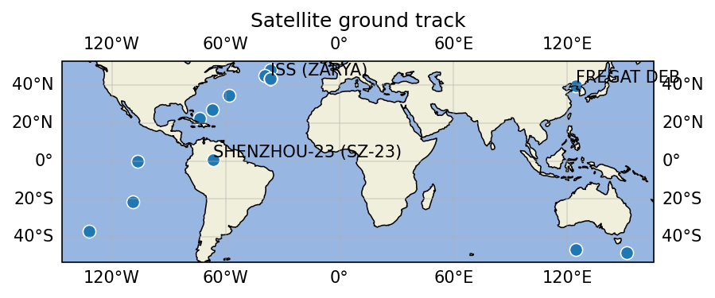

# Satellite-Orbit-Predictor-Anomaly-Detector
A portfolio-grade Python + ML project that pulls public NORAD TLE data, predicts satellite orbital positions, and layers a machine-learning anomaly detector to flag unusual behavior (station-keeping burns, collision risks, deorbiting events).



## What It Does

- Pulls live TLE data from CelesTrak's NORAD station feed (26 active satellites including the ISS, Crew Dragon, and Shenzhou vehicles).
- Propagates orbital positions using the SGP4 algorithm via the `skyfield` library, predicting latitude, longitude, and altitude at any UTC timestamp.
- Plots ground tracks on a PlateCarree projection using `matplotlib` + `Cartopy`, with coastlines, lat/lon gridlines, and satellite name labels.

## Quick Start

```bash
git clone https://github.com/FedorowiczDominik624/Satellite-Orbit-Predictor-Anomaly-Detector.git
cd Satellite-Orbit-Predictor-Anomaly-Detector
python -m venv venv
.\venv\Scripts\Activate.ps1    # Windows PowerShell
# source venv/bin/activate      # macOS / Linux
pip install -r requirements.txt
python main.py
```

## Tech Stack

Python 3.12 · `skyfield` · `sgp4` · `Cartopy` · `matplotlib` · `pytest`

## Roadmap

*Planned next phase — turning the current pipeline into the anomaly detector the project name promises.*

- **ML anomaly detection** — Detect station-keeping burns, unexpected maneuvers, and deorbit events using an unsupervised model (e.g., Isolation Forest or autoencoder) trained on propagated-vs-observed position residuals.
- **Historical TLE diffing** — Track how key orbital elements (semi-major axis, inclination, eccentricity, RAAN) evolve between TLE epochs, establishing the baseline behavior the anomaly detector needs to flag what's abnormal.